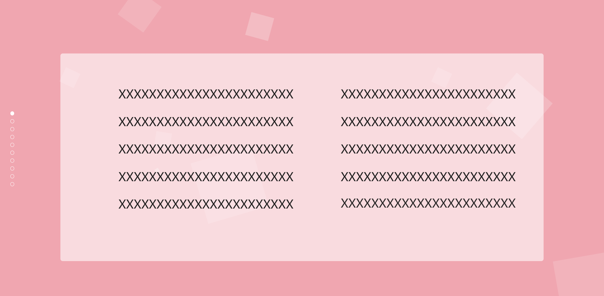
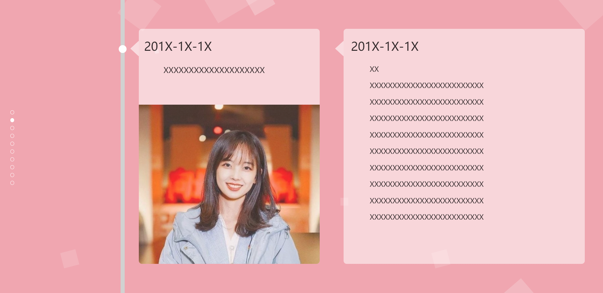
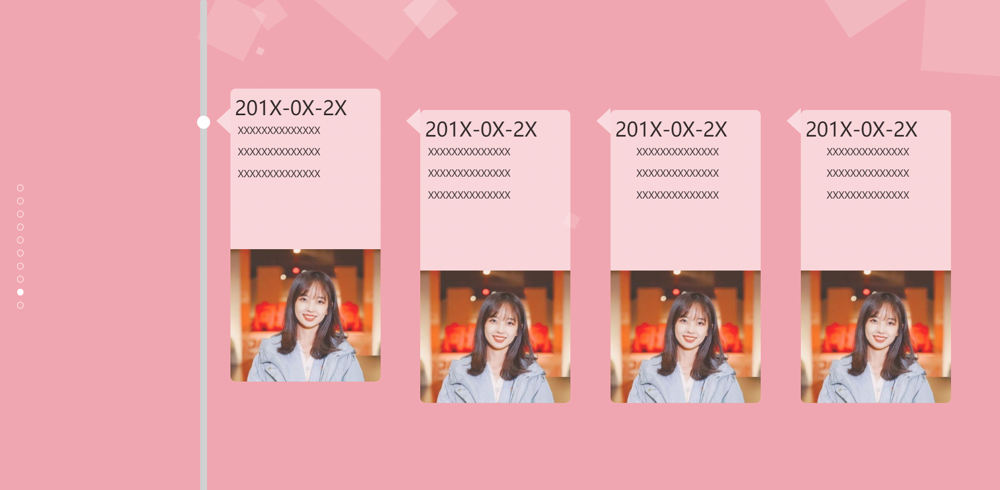
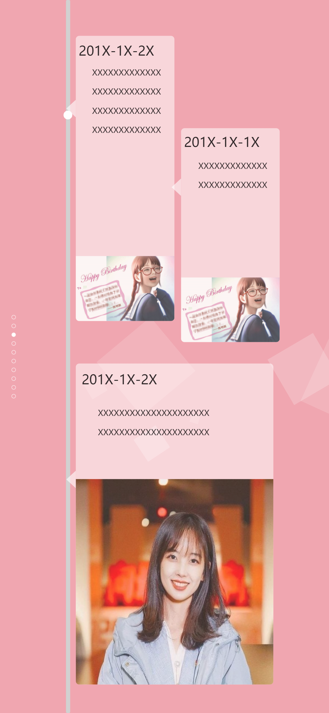
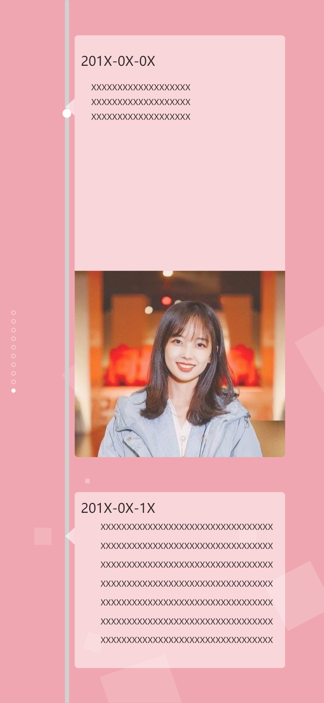
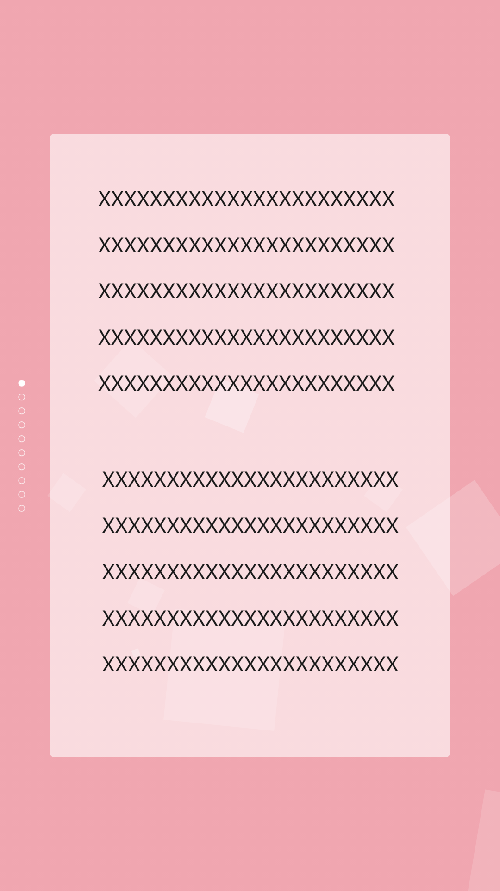
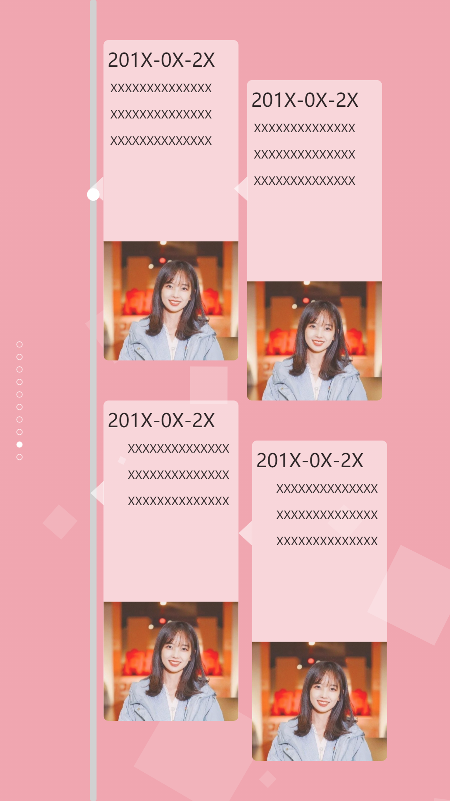

## birthday-mobile

### 说明

根据birthday-basic原版进行的修改，正如原版的README所说：

> 当年写的代码能把你气个半死

css代码确实很乱(ಡωಡ)，简单改了一下，电脑和手机都可以正常排版显示，iPad显示图片可能会遮挡文字，没有作特别适配，估计也很少有人会拿iPad去扫码看网页....

### 使用前提

 <a href="#important">注意点</a>

如果你具备前端开发的相关经验，那么可以自由地在这个模板上进行相关的修改，代码很乱，锅我不背，甩给原作者(ಡωಡ)

如果你不具备任何前端开发的经验，那么或许可以考虑换个东西送？

如果你只是简单了解相关知识，那么你可以阅读下面的引导来了解这个模板。

### 模板介绍
#### 修改密码
 在当前目录下，有js/index.js文件：
 ```javascript
 //修改此处的123,123即可修改登录的用户名和密码
 if(userName=="123" &&  pwd=="123"){
   event.preventDefault();
   $('form').fadeOut(500);
   $('.wrapper').addClass('form-success');
   setTimeout(function(){location.href="BirthdayCake.html";},2000);
 }
 ```

#### 替换memories页面文字和图片
以第三屏为例：
```html
<!--第三屏-->

<div class="section">
    <!-- 下面两个div分别实现的左边那条轴和那个小球 -->
    <div class="timeline"></div>
    <div class="timepoint21"></div>
    <div class="ly-box21">
        <div class="ly-txt21">
            <!-- 这里更改日期 -->
            201X-1X-2X
        </div>
        <div class="ly-txt22">
          <!-- 这里更改内容，段落、换行用<p></p>包裹起来 -->
           <p> XXXXXXXXXXXXXXXXXXXXXXXXXXXXXXXXXXXXXXXXXXXXXXX</p>
           <p>XXXXXXXXXXXXXXXXXXXXXXXXXXXXXXXXXXXXXXXXXXXXXXX</p>
        </div>
        <div class="ly-imgbox21">
          <!-- 这里更改图片，图片请先改好对应的名字并且放到img文件夹下面
              如果你不懂css，那么最好就裁剪图片至合适大小为止
              如果你会css，那么可以根据class名字去修改对应css的宽度设置-->
          
        </div>
    </div>
    <div class="ly-triangle21"></div>

    <div class="ly-box22">
        <div class="ly-txt23">
          <!-- 与上面类似，不再多说 -->
            201X-1X-1X
        </div>
        <div class="ly-txt24">
            XXXXXXXXXXXXXXXXXXXXXXXXXXXXXXXXXXXXXXXXXXXXXXXX
        </div>
        <div class="ly-imgbox22">
          
        </div>
    </div>
    <div class="ly-triangle22"></div>

     <div class="ly-box23">
        <div class="ly-txt25">
            201X-1X-2X
        </div>
        <div class="ly-txt26">
            XXXXXXXXXXXXXXXXXXXXXXXXXXXXXXXXXXXXXXXXXXXXXXXXXXX
        </div>
        <div class="ly-imgbox23">
          
        </div>
    </div>
    <div class="ly-triangle23"></div>
</div>
```

## 如何给别人看
1. 打成压缩包发给别人
2. 部署至云服务器或者虚拟主机（需要域名，成本较高）
  3. 部署至Gitee Pages（gitee在国内，速度快，微信不回拦截，无需域名和服务器/虚拟主机，几乎零成本）

如果需要用域名访问，请先去购买域名，然后按照教程进行解析。


##### 小建议(ಡωಡ)：

- 将页面部署至云端，将地址生成二维码，然后手绘或者雕刻二维码效果可能比较好，显得用心，但不确定时也要慎用，可能最后只是感动自己，节省时间干啥不好(ಡωಡ)。
- 二维码可以雕刻在礼物上，如木制工艺品，或者画在卡片上随礼物赠送


## <a id="important" style="color: #000;">注意点</a>

Google Chrome浏览器更新后会拦截自动播放音乐，暂时无解（有没有我也不知道，没研究(ಡωಡ)）

其他Chrome内核浏览器无影响，如新版Edge

Firfox未测试

**手机屏幕大小不同，建议根据实际屏幕大小修改Memories.html页面，防止图片遮挡文字。**


## 其它问题
有问题请发邮件至 [oxygen@mapletown.xyz](oxygen@mapletown.xyz)，公有问题我会继续更新在README

## 改进计划
暂无，后续可能会整理代码（感觉要重写），提高浏览器兼容性


## 截图

#### 电脑端








#### 移动端（窄屏，如iPhone X）







#### 移动端（宽屏，如三星 S5）





